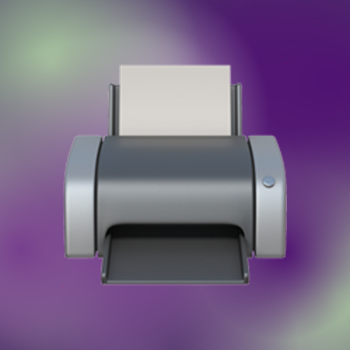

# Botpic Generator
Desktop app for generating Telegram botpics (avatars)

### Usage
```sh
botpic gen <emoji> <main_color> [additional_colors ...]
```

```sh
botpic emojis  # to see the list of available emojis
```
<br>

> [!WARNING]
> Not all emojis might be present!  
> If you spotted that some emoji is missing in the list, your **report in Issues section would be highly appreciated** 🔥
<br>

# Examples

#### Emoji on black background
```sh
botpic gen books 000000
```


---

#### Emoji on gradient background
```sh
botpic gen smirking-face ffffff d3fad6 d1efb5 edeba0 c3c48d 928c6f
```


---

#### Emoji with more gradient drops (opt. `-d` `--drops`)
```sh
botpic gen --drops 1000 telephone 003049 d62828 f77f00 fcbf49 eae2b7 76818e
```


---

#### Emoji scaled to 2x (default 1.5x) (opt. `-s` `--emoji_scale`)
```sh
botpic gen --emoji_scale 2 printer 4a4063 4a4063 bfacc8 a8c69f 783f8e 4f1271
```

